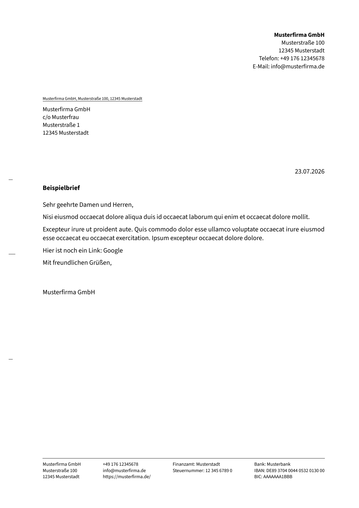
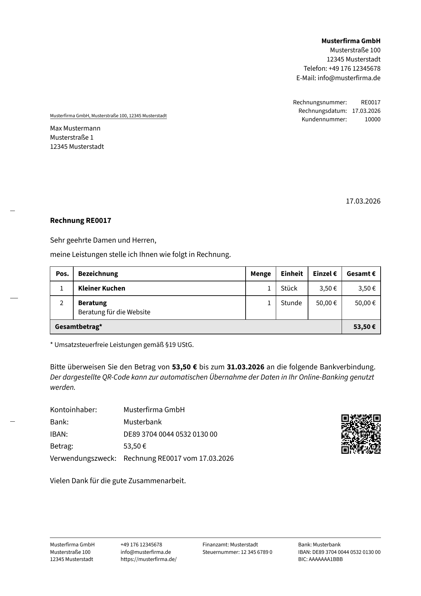
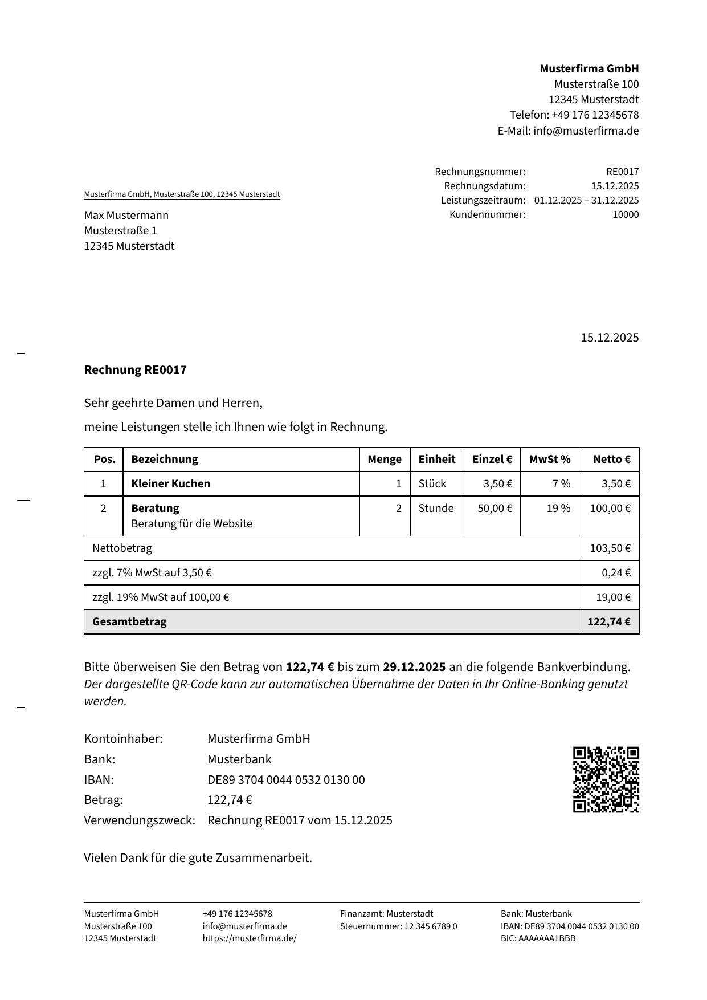

# Invoice Toolkit

This project is a **toolkit for generating invoices and letters** from simple
configuration files. While there are many tools and templates out there, I found it
difficult to find a _simple template_ that I could _easily modify_ to my needs. The goal
of this project is to provide simple templates that can be easily modified to suit also
your needs.

## Preview

| Letter Template                                                                              | Invoice Template (no VAT)                                                                                        | Invoice Template (with VAT)                                                                          |
| -------------------------------------------------------------------------------------------- | ---------------------------------------------------------------------------------------------------------------- | ---------------------------------------------------------------------------------------------------- |
| [](examples/letter/letter.example.pdf) | [](examples/vat-exempt/invoice.example.pdf) | [](examples/vat/invoice.example.pdf) |

## Invoice and Letter Template

**Features:**

- Invoice Template
- Letter Template
- Migrate to typst for faster rendering
- Type validation using [pydantic](https://docs.pydantic.dev)
- Support schema validation for VSCode (schemas are located in the `schemas` directory)
- QR Code generation for bank transfer using [qrbill](https://ctan.org/pkg/qrbill)
- Support multiple pages for invoices
- Easy interaction using [just](https://just.systems/man/en/)
- Python dependency management using [uv](https://docs.astral.sh/uv/)
- Keep track of the amount of invoices (using a `csv` file)
- Open Thunderbird with the generated pdf as attachment
  - Requires Thunderbird to be installed as a `flatpak` package
  - Additionally, you need to allow Thunderbird to access the output directory
  - You can disable this feature by setting `settings.open_mail_client` to `false` in
    `config.yml`

## Getting Started

You can either just clone this repository or create a fork of it. First of all, you need
to install the dependencies using **[uv](https://github.com/astral-sh/uv)** (if you
haven't heard of it, you should google it, and follow a tutorial on how to use it).
Additionally I suggest using **[just](https://just.systems/man/en/)**.

For initial testing, I created some example configuration files. If you want **to
customize the templates** to your needs, **see
[examples/README.md](examples/README.md)**.

Following, you should be able to create your first invoice or letter:

```bash
just invoice [invoice-path]
just letter [letter-path]
```

Omit the path argument to generate the bundled example. Run `just --list` to see all
available commands.

## License

This project is licensed under the GNU GPLv3 License - see the [COPYING](COPYING) file
for details.

_The invoice template is inspired by a template from
[Selfnet e.V.](https://www.selfnet.de/)._
