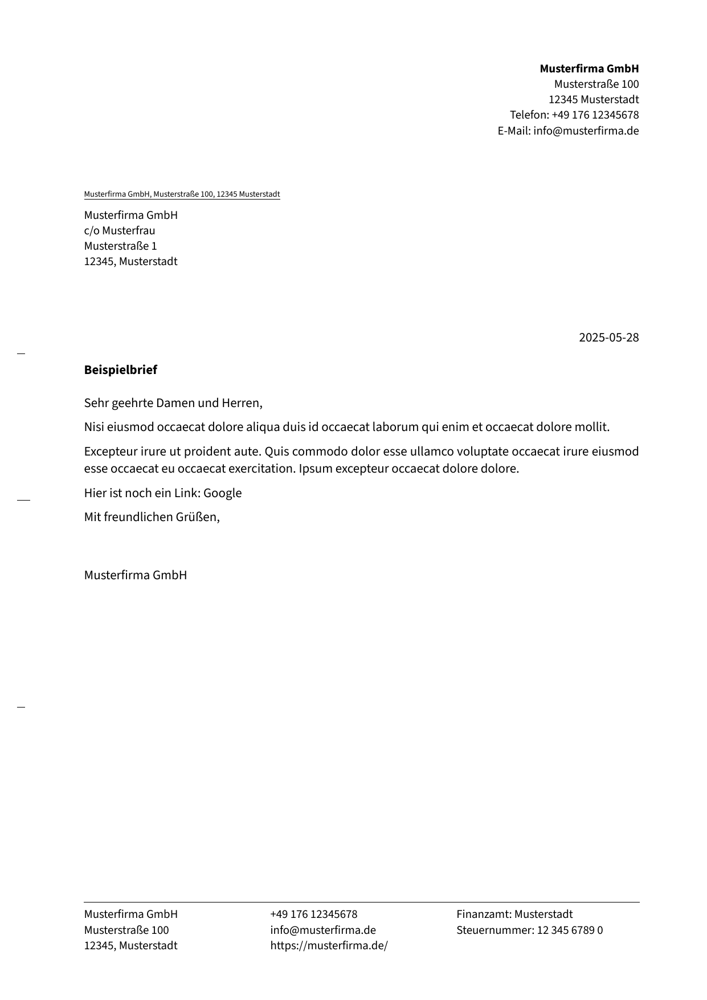

# Latex Templates

This project is intended to be a **collection of templates** for invoices and letters. While there are many tools and templates out there, I found it difficult to find a _simple template_ that I could _easily modify_ to my needs. The goal of this project is to provide a simple template that can be easily modified to suit also your needs.

## Preview

| Letter Template                                                                | Invoice Template                                                                  |
| ------------------------------------------------------------------------------ | --------------------------------------------------------------------------------- |
| [](examples/letter.example.pdf) | [](examples/invoice.example.pdf) |

## Invoice and Letter Template

**Features:**

- [x] Invoice Template
- [x] Letter Template
- [ ] Support for multiple languages
  - Currently only german is supported.
- [ ] Support for multiple currencies
- [x] Type validation using [pydantic](https://docs.pydantic.dev)
- [x] Support schema validation for VSCode (schemas are located in the `schemas` directory)
- [x] QR Code generation for bank transfer using [qrbill](https://ctan.org/pkg/qrbill)
- [ ] Support `VAT > 0` (currently only `VAT = 0` is supported)
- [x] Support multiple pages for invoices
- [x] Easy interaction using [just](https://just.systems/man/en/)
- [x] Using a `texlive/texlive:latest-full` container for building the templates
- [x] Python dependency management using [uv](https://docs.astral.sh/uv/)
- [x] Keep track of the amount of invoices (using a `csv` file)
- [x] Open Thunderbird with the generated pdf as attachment
  - Requires Thunderbird to be installed as a `flatpak` package
  - Additionally, you need to allow Thunberbird to access the output directory (**Note:** This is a security risk, as it allows Thunderbird to access all files in the output directory)
  - Alternatively you can disable this feature by setting `OPEN_MAIL` to `false` in the `.env` file

## Getting Started

> :warning: You will need to have [podman](https://podman.io) or [docker](https://www.docker.com) installed on your system

You can either just clone this repository or create a fork of it. First of all, you need to install the dependencies using **[uv](https://github.com/astral-sh/uv)** (if you haven't heard of it, you should google it, and follow a tutorial on how to use it). Additionally I suggest using **[just](https://just.systems/man/en/)**.

For initial testing, I created some example configuration files. If you want **to customize the templates** to your needs, **see this [file](examples/README.md)**.

Following, you should be able to create your first invoice by running the following command:

```bash
just invoice <invoice-path>

# If you just want to generate the example invoice
just invoice
```

or if you want to create a letter:

```bash
just letter <letter-path>

# If you just want to generate the example letter
just letter
```

You can view all available commands by running `just --list` (or just `just`).

## License

This project is licensed under the GNU GPLv3 License - see the [COPYING](COPYING) file for details.

_The invoice template is inspired by a template from [Selfnet e.V.](https://www.selfnet.de/)._
